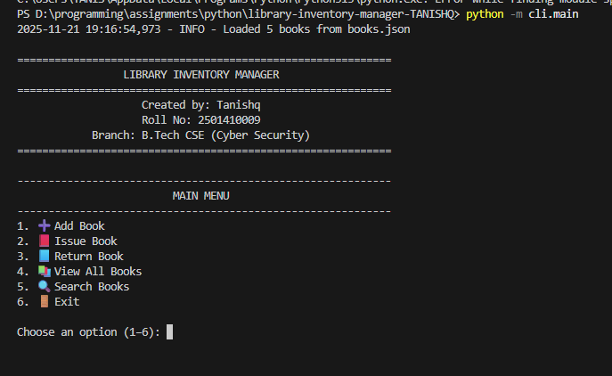
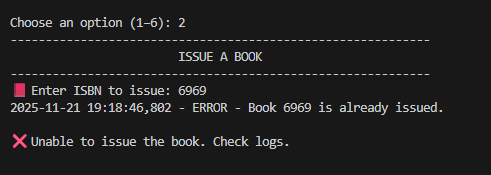

# 📚 Library Inventory Manager  

A Python-based command-line application to manage a library’s book inventory.  
This project demonstrates **Object-Oriented Programming**, **JSON file handling**, **error handling**, and a **menu-driven CLI** as required in Lab Assignment 3.

---





## ✨ Features

### ✔ Book Management  
- Add new books  
- View all books  
- Search by **title** or **ISBN**

### ✔ Issue & Return System  
- Issue a book (status becomes *issued*)  
- Return a book (status becomes *available*)

### ✔ Persistent Storage  
- Saves all books to `books.json`  
- Loads automatically on startup  
- Recovers from missing/corrupted JSON file

### ✔ Error Handling & Logging  
- Duplicate ISBN prevention  
- Safe read/write to JSON  
- Logs actions for debugging

---

## 🧩 Project Structure

```
library-inventory-manager/
├── library_manager/
│   ├── __init__.py
│   ├── book.py
│   └── inventory.py
├── cli/
│   └── main.py
├── tests/
│   └── test_inventory.py
├── books.json
├── README.md
├── .gitignore
└── requirements.txt
```

---

## 🚀 How to Run the Project

### 1️⃣ Create & Activate Virtual Environment

Windows:
```
python -m venv venv
venv\Scripts\activate
```

macOS / Linux:
```
python3 -m venv venv
source venv/bin/activate
```

---

### 2️⃣ Install Dependencies
```
pip install -r requirements.txt
```

---

### 3️⃣ Run the Program
```
python -m cli.main
```

---

## 🧪 Running Tests
```
pytest -q
```

---

## 🔎 Usage Example

Adding a Book:
```
Title: Atomic Habits
Author: James Clear
ISBN: 101
```

Issuing a Book:
```
Enter ISBN to issue: 101
Book issued.
```

Viewing All Books:
```
1. Atomic Habits by James Clear (ISBN: 101) - available
```

---

## 🛠 Modules Overview

### `book.py`  
Defines the Book class.

### `inventory.py`  
Handles all inventory operations.

### `cli/main.py`  
Menu-driven interface.

### `test_inventory.py`  
Basic unit test.

---

## 📝 JSON File Format (books.json)

```
[
  {
    "title": "Atomic Habits",
    "author": "James Clear",
    "isbn": "101",
    "status": "available"
  }
]
```

---

## 🎓 Credits  
Developed for Lab Assignment 3 — Programming for Problem Solving Using Python.
